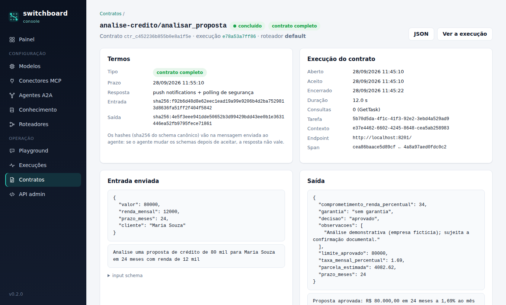
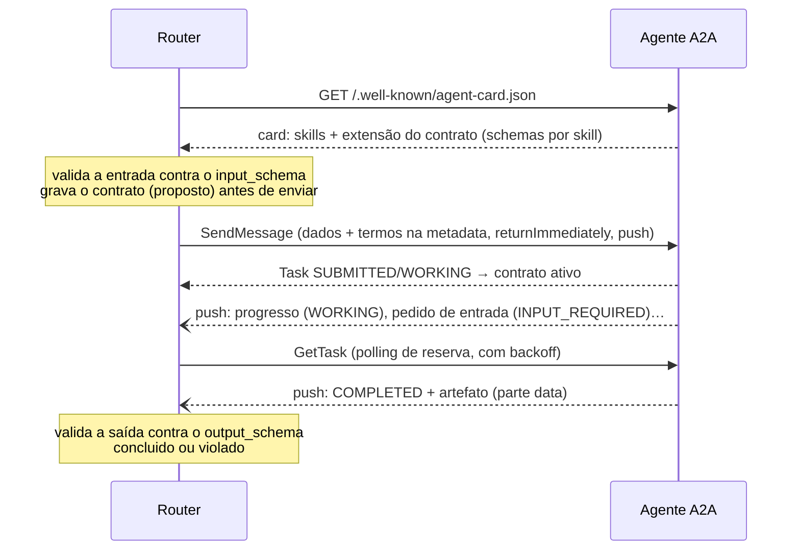

# Contrato fechado com agentes A2A

Toda delegação a um agente A2A abre um **contrato**. Os termos são fixados no momento em que o roteador delega — quem pede, qual skill, com que entrada, em que formato volta a saída e até quando — e daí em diante o roteador só conversa com aquele agente, sobre aquela tarefa, através do contrato. Ele termina num estado final auditável, com a linha do tempo de tudo o que aconteceu.

Este documento descreve a extensão A2A `urn:switchboard:a2a:contract:v1`: o que o agente publica, o que viaja em cada mensagem, a máquina de estados e como escrever um agente que fala o contrato. A decisão de desenho está na [ADR 0001](adr/0001-decisao-hibrida-e-contratos-a2a.md).



## Visão geral



## O que o agente publica: o Agent Card

O agente declara a extensão em `capabilities.extensions` e, em `params.skills`, os termos de cada skill:

```json
{
  "name": "analise-credito",
  "supportedInterfaces": [{"url": "http://agente:8201/", "protocolBinding": "JSONRPC", "protocolVersion": "1.0"}],
  "capabilities": {
    "pushNotifications": true,
    "extensions": [{
      "uri": "urn:switchboard:a2a:contract:v1",
      "required": true,
      "params": {
        "version": "1",
        "skills": {
          "analisar_proposta": {
            "input_schema":  {"type": "object", "properties": {"valor": {"type": "number"}}, "required": ["valor"]},
            "output_schema": {"type": "object", "properties": {"decisao": {"type": "string"}}, "required": ["decisao"]},
            "max_duration_s": 900
          }
        }
      }
    }]
  },
  "skills": [{"id": "analisar_proposta", "name": "Analisar proposta de crédito", "description": "…", "examples": ["…"]}]
}
```

| Termo | Obrigatório | Uso |
|---|---|---|
| `input_schema` | não* | JSON Schema (Draft 2020-12) da entrada. O roteador valida os argumentos **antes** de enviar; o decisor usa os campos obrigatórios para perguntar o que falta. |
| `output_schema` | não* | JSON Schema da saída. O roteador valida o resultado **ao receber**. |
| `max_duration_s` | não | Compromisso de duração da skill; entra no cálculo do prazo. |

\* Pelo menos um dos dois schemas. Schemas inválidos aparecem como problema da skill no console e ela fica fora do roteamento até ser corrigida.

Na descoberta o roteador também confere que o endpoint JSON-RPC do card está **na mesma origem** (esquema, host e porta) da URL cadastrada — `localhost`, `127.0.0.1` e `::1` contam como o mesmo host. Um card que aponte as chamadas para outro host é recusado, a não ser que o agente esteja cadastrado com `allow_cross_origin`.

### Contrato completo e contrato básico

- **Completo**: a skill declara termos na extensão. Entrada e saída são dados estruturados (parte `data`), validados dos dois lados, e os schemas viajam como hash em cada mensagem.
- **Básico**: o agente não conhece a extensão (qualquer agente A2A 1.0). O roteador envia uma instrução em texto autocontida (o decisor preenche `{"instrucao": "…"}`) e aceita a resposta em texto. O contrato continua valendo para prazo, estados e cancelamento.

## O que viaja em cada mensagem

O `SendMessage` que abre o contrato leva a entrada, os termos e a configuração de retorno:

```json
{
  "jsonrpc": "2.0", "id": "…", "method": "SendMessage",
  "params": {
    "message": {
      "messageId": "…", "role": "ROLE_USER",
      "parts": [
        {"data": {"cliente": "Maria Souza", "valor": 80000, "prazo_meses": 24, "renda_mensal": 12000}, "mediaType": "application/json"},
        {"text": "Analise uma proposta de crédito de 80 mil para Maria Souza em 24 meses com renda de 12 mil"}
      ],
      "extensions": ["urn:switchboard:a2a:contract:v1"],
      "metadata": {
        "urn:switchboard:a2a:contract:v1": {
          "contract_id": "ctr_c452236b855b0e8a1f5e",
          "version": 1,
          "skill": "analisar_proposta",
          "kind": "completo",
          "deadline": "2026-09-28T11:55:10+00:00",
          "caller": {"system": "switchboard", "profile": "default", "run_id": "e78a53a7…"},
          "input_schema_sha256": "sha256:f92b6d48…",
          "output_schema_sha256": "sha256:4e5f3eee…"
        }
      }
    },
    "configuration": {
      "acceptedOutputModes": ["application/json", "text/plain"],
      "returnImmediately": true,
      "taskPushNotificationConfig": {"url": "http://router:8080/a2a/push/ctr_c452236b855b0e8a1f5e", "token": "…"}
    },
    "metadata": {"traceparent": "00-e78a53a7…-cea86baace5d89cf-01", "switchboard": {"run_id": "e78a53a7…", "contract_id": "ctr_c452236b855b0e8a1f5e"}}
  }
}
```

Cabeçalhos: `A2A-Version: 1.0`, `A2A-Extensions: urn:switchboard:a2a:contract:v1` (contrato completo), `traceparent` (W3C, o mesmo `trace_id` da execução no roteador) e `Authorization: Bearer …` quando o agente tem token cadastrado.

- **Hash dos schemas**: SHA-256 da forma canônica do schema — chaves ordenadas, sem espaços, números inteiros sem `.0` (o protobuf `Struct` do SDK transforma `480` em `480.0`, e os dois lados precisam chegar ao mesmo valor). Se o agente mudou o schema depois da descoberta, os hashes não conferem e ele rejeita a tarefa em vez de trabalhar com termos diferentes dos combinados.
- **Prazo** (`deadline`, absoluto): o `deadline_s` do cadastro do agente, quando definido, vale sobre tudo; senão, o menor entre o `max_duration_s` da skill e o `deadline_s` do roteador (padrão 600 s).
- **`returnImmediately`**: o agente responde na hora com a tarefa criada; quem espera é o roteador, não a conexão HTTP.
- **Push notifications**: só quando o cadastro do agente permite (`push`, ligado por padrão), o card anuncia `pushNotifications` e o roteador tem uma URL pública (`SWITCHBOARD_PUBLIC_URL`). O token é exclusivo do contrato (o banco guarda só o hash) e volta no cabeçalho `X-A2A-Notification-Token`; push com token errado recebe 401. Mesmo com push, o supervisor do roteador consulta a tarefa (`GetTask`) de tempos em tempos, com backoff, para não depender só das notificações.

A resposta do usuário a um pedido de entrada vai na **mesma tarefa** (`taskId` e `contextId` da tarefa original) e com os mesmos termos na `metadata`.

## Estados

```
proposto ──► ativo ◄──► aguardando_entrada
   │           │              │
   └───────────┴──────────────┴──► concluido | falhou | rejeitado | cancelado | expirado | violado
```

| Estado | Quando |
|---|---|
| `proposto` | gravado antes do envio (o push pode chegar antes da resposta do `SendMessage`) |
| `ativo` | o agente aceitou: `TASK_STATE_SUBMITTED` ou `TASK_STATE_WORKING` |
| `aguardando_entrada` | `TASK_STATE_INPUT_REQUIRED`: a pergunta do agente vai para o usuário e a execução fica `needs_input` |
| `concluido` | `TASK_STATE_COMPLETED` com saída válida |
| `falhou` | `TASK_STATE_FAILED` (ou `AUTH_REQUIRED`), erro de rede no envio ou agente que não confirma a tarefa |
| `rejeitado` | `TASK_STATE_REJECTED` ou erro JSON-RPC no envio (termos recusados, entrada inválida, prazo vencido) |
| `cancelado` | cancelamento pedido pelo cliente (`POST /v1/runs/{id}/cancel`) — o roteador manda `CancelTask` |
| `expirado` | o prazo venceu — o roteador manda `CancelTask` |
| `violado` | o agente quebrou o contrato: saída fora do `output_schema`, sem a parte `data` exigida ou resposta de protocolo inválida |

Nada sai de um estado terminal: eventos que chegam depois (um push atrasado, por exemplo) são registrados e ignorados, assim como eventos de outra tarefa. Como push, resposta do `SendMessage` e polling chegam fora de ordem, o roteador também aplica duas regras: `aguardando_entrada` só volta a `ativo` pela resposta do usuário (um `WORKING` atrasado não desfaz o pedido de entrada), e um `INPUT_REQUIRED` com a mesma pergunta que o usuário já respondeu — identificada pelo `messageId` da mensagem de status (ou, sem ele, pelo carimbo de tempo) — é um retrato antigo, não um pedido novo. Uma conclusão recebida por push sem a tarefa inteira faz o roteador buscar a tarefa (`GetTask`) antes de validar a saída. Cada mudança vira um evento do contrato (`state`, `message`, `artifact`, `note`, `violation`) com a origem — `router`, `response`, `push` ou `poll` — e o console mostra essa linha do tempo.

Quando o último contrato de uma execução chega a um estado final, a execução é **consolidada** uma única vez (a troca de estado no banco é condicional, então vários processos do router podem receber eventos ao mesmo tempo) e quem espera — o pedido original, `GET /v1/runs/{id}`, o SSE e o `callback_url` — recebe a resposta final.

## Do lado do agente: `switchboard-agentkit`

O pacote `switchboard-agentkit` implementa o lado do agente sobre o SDK oficial (`a2a-sdk`): publica o card com a extensão, confere os termos de cada tarefa (skill conhecida, hashes iguais aos publicados, prazo não vencido), valida a entrada e valida a própria saída antes de entregar — um agente que produziria algo fora do contrato falha em vez de entregar.

```python
from switchboard_agentkit import ContractAgent, SkillContext, SkillFailed, SkillResult

agent = ContractAgent(
    name="cambio",
    description="Cotações e câmbio para clientes.",
    # URL pública: vai no card como endpoint JSON-RPC
    url="http://localhost:8301",
    # destinos aceitos nas URLs de push: host ou host:porta (None = qualquer um)
    push_hosts=["localhost", "router:8080"],
    # opcional: exige este Bearer no JSON-RPC (o card continua público)
    auth_tokens=["token-do-roteador"],
)


@agent.skill(
    "cotar",
    name="Cotar câmbio",
    description="Cota a conversão de reais para uma moeda estrangeira.",
    input_schema={
        "type": "object",
        "properties": {
            "valor": {"type": "number", "exclusiveMinimum": 0},
            "moeda": {"enum": ["usd", "eur"]},
        },
        "required": ["valor", "moeda"],
    },
    output_schema={
        "type": "object",
        "properties": {"convertido": {"type": "number"}, "taxa": {"type": "number"}},
        "required": ["convertido", "taxa"],
    },
    max_duration_s=120,
    examples=["Quanto dá 1.000 reais em dólar?"],
)
async def cotar(ctx: SkillContext, dados: dict) -> SkillResult:
    await ctx.progress("consultando a mesa de câmbio")  # WORKING, com mensagem
    if dados["valor"] > 50_000 and not ctx.replies:
        ctx.require_input("Acima de R$ 50 mil a cotação é da mesa. Confirma? (sim/não)")
    if ctx.replies and ctx.replies[-1].strip().lower().startswith("n"):
        raise SkillFailed("cotação cancelada pelo cliente")
    taxa = {"usd": 5.0, "eur": 6.0}[dados["moeda"]]
    convertido = round(dados["valor"] / taxa, 2)
    return SkillResult(
        {"convertido": convertido, "taxa": taxa}, text=f"{convertido} {dados['moeda'].upper()}"
    )


if __name__ == "__main__":
    agent.run(host="127.0.0.1", port=8301)  # ou: app = agent.build_app() (Starlette)
```

- `ctx.progress(texto)` publica progresso (`WORKING`); o roteador mostra a última mensagem no console.
- `ctx.require_input(pergunta)` põe a tarefa em `INPUT_REQUIRED`. Quando a resposta chega (mesma tarefa), a skill roda de novo com as respostas em `ctx.replies`.
- `SkillFailed(motivo)` termina a tarefa como `FAILED`; exceções inesperadas também, com a mensagem do erro.
- `ContractAgent(require_contract=False)` aceita tarefas sem os termos (clientes A2A que não conhecem a extensão).
- `auth_tokens` exige o token que o roteador envia (`auth_token` no cadastro do agente, de preferência `env:A2A_…`); `push_hosts` limita para onde o agente manda push notifications. Os agentes de exemplo leem `AGENT_TOKENS` e `AGENT_PUSH_HOSTS` (padrão: só a própria máquina).

Os agentes de exemplo em [examples/agents](../examples/agents/src/switchboard_agents) — `analise-credito` (tarefa longa que pede garantia acima de R$ 500 mil) e `risco` — são implementações completas.

Um agente escrito com outro SDK ou em outra linguagem fala o contrato se: publicar a extensão no card com os schemas de cada skill; ler `message.metadata["urn:switchboard:a2a:contract:v1"]`, conferir `skill`, os dois hashes (mesma forma canônica) e o `deadline`, e responder `TASK_STATE_REJECTED` com o motivo quando algo não bater; e entregar a saída como uma parte `data` num artefato antes de `TASK_STATE_COMPLETED`.

## Testando à mão

Com a stack de demonstração no ar (`docker compose up -d` ou `./scripts/dev.sh`):

```bash
# o card, com a extensão do contrato
curl -s http://localhost:8201/.well-known/agent-card.json | python3 -m json.tool

# uma delegação: volta 202 + run_id se passar da espera do roteador
curl -s http://localhost:8080/v1/chat -H 'Content-Type: application/json' -d '{
  "message": "Analise uma proposta de crédito de 80 mil para Maria Souza em 24 meses com renda de 12 mil",
  "wait_s": 0}'

# acompanhe: GET (polling), SSE ou cancelamento
curl -s http://localhost:8080/v1/runs/<run_id>
curl -N http://localhost:8080/v1/runs/<run_id>/events
curl -s -X POST http://localhost:8080/v1/runs/<run_id>/cancel

# os contratos, com termos, entrada, saída e eventos
curl -s 'http://localhost:8000/api/contracts?agent=analise-credito'
```

`python3 scripts/smoke.py` (ou `make smoke`) percorre todos esses caminhos — inclusive o pedido de entrada no meio do contrato — e é o mesmo teste que o CI roda contra o `docker compose`.
