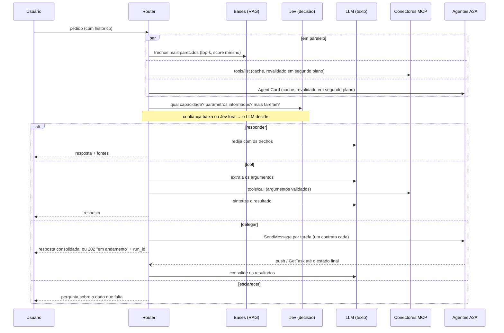
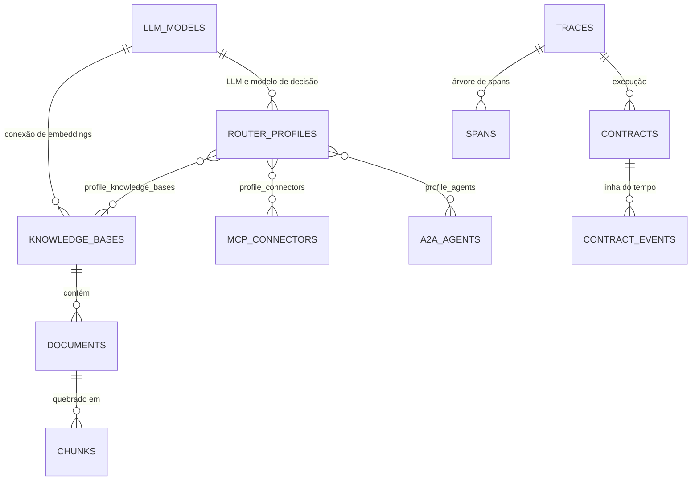

# Arquitetura

O Switchboard separa **quem configura** de **quem atende**, como um gateway separa control plane de data plane:

- **Console** (`apps/console`) — UI server-rendered (FastAPI + Jinja) e API admin em JSON. Grava modelos, conectores MCP, agentes A2A, bases e roteadores no banco, indexa documentos e mostra execuções, contratos e spans.
- **Router** (`apps/router`) — API de chat. Lê a configuração do banco (cache de 5 s), atende os pedidos, abre e acompanha os contratos com agentes (supervisor em segundo plano) e grava execuções, contratos e spans.
- **Core** (`packages/core`, pacote `switchboard`) — o framework usado pelos dois: LLMs, cliente do Jev, embeddings, RAG, conectores MCP, cliente A2A, contratos, motor de roteamento, spans e storage. Também roda sozinho, configurado por YAML.
- **Agentkit** (`packages/agentkit`) — o lado do agente do contrato, sobre o SDK oficial do A2A.

As decisões de desenho estão na [ADR 0001](adr/0001-decisao-hibrida-e-contratos-a2a.md); o contrato com agentes, em [a2a-contrato.md](a2a-contrato.md).

## Fluxo de um pedido



### 1. RAG e descoberta

As duas etapas rodam em paralelo.

**RAG.** A pergunta (o último turno do usuário; turnos muito curtos herdam o anterior, para follow-ups como "e no sábado?") vira vetor pelo embedder de cada base e é comparada por similaridade de cosseno com os trechos indexados. Entram os `top_k` trechos com score acima de `min_score`, numerados (`[1]`, `[2]`…) com base, documento e seção.

**Descoberta.** Para cada conector MCP, o catálogo abre uma sessão (Streamable HTTP ou SSE), faz o handshake e chama `tools/list` (seguindo a paginação). Para cada agente A2A, o diretório busca o Agent Card, escolhe a interface JSON-RPC 1.x, confere que ela está na mesma origem da URL cadastrada e lê os termos de cada skill na extensão do contrato. Os dois têm timeout curto (5 s) e cache (30 s online, 15 s offline); quando o cache vence, o valor antigo é servido na hora e a nova descoberta roda em segundo plano — um servidor travado nunca segura os pedidos. Quem está fora do ar sai do catálogo e gera um aviso no trace; as allowlists (`allowed_tools`, `allowed_skills`) filtram antes de chegar ao decisor.

O resultado é um **catálogo único de capacidades** (`switchboard.routing.capabilities`): cada tool MCP e cada skill A2A, identificada por `dono/nome`, com descrição, exemplos e o schema de argumentos. Skills com contrato básico recebem o schema de uma instrução em texto (`instrucao`); skills com schemas inválidos ficam de fora.

### 2. Decisão

Há três decisores, do mais barato ao mais geral, e o motor escolhe pelo perfil:

| Decisor | Quando | Como |
|---|---|---|
| **Jev** (`JevDecider`) | o perfil tem `decision_model` | perguntas tipadas com probabilidades: `choice` da capacidade (ou `knowledge` / `out_of_scope`), `noul` por skill para *fan-out*, `noul` para "os trechos respondem?" e `noul` por parâmetro obrigatório. Os valores dos argumentos continuam vindo do LLM (o Jev não extrai valores), mas um valor para um parâmetro que o Jev diz não ter sido informado é descartado e vira pergunta |
| **LLM** (`LLMDecider`) | sem modelo de decisão, ou quando o Jev escala | o LLM recebe o system prompt, as regras de roteamento, o catálogo e os trechos e devolve **um objeto JSON** |
| **Heurístico** (`HeuristicDecider`) | modelo `offline` ou provedor fora do ar | palavras-chave do pedido contra nome, título e descrição das capacidades; extração de argumentos do texto (R$, mil, %, meses, anos, nomes, opções de `enum`, palavras perto de cada número); resposta extrativa com o melhor trecho |

O JSON do LLM:

```json
{"action": "answer",   "answer": "...", "sources": [1, 2], "reason": "..."}
{"action": "tool",     "connector": "credito", "tool": "simular_financiamento", "arguments": {"valor": 50000, "prazo_meses": 24, "taxa_mensal_percentual": 1.5}}
{"action": "delegate", "tasks": [{"agent": "analise-credito", "skill": "analisar_proposta", "arguments": {...}},
                                 {"agent": "risco", "skill": "avaliar_risco", "arguments": {...}}]}
{"action": "clarify",  "question": "...", "reason": "..."}
```

A leitura é tolerante (aceita bloco ```json, texto em volta, sinônimos em português como `delegar`) e a decisão é **validada contra o catálogo real**: a capacidade precisa existir, tools e skills não se misturam num mesmo pedido, `delegate` tem no máximo `max_parallel` tarefas e os argumentos são convertidos e conferidos contra o schema (tipos, `enum`, obrigatórios). Se algo não bate, o motor devolve o erro ao modelo pedindo um reparo (uma tentativa). Argumento obrigatório faltando vira pergunta de esclarecimento. Com provedor compatível com OpenAI, a decisão usa `response_format: json_object` quando o servidor aceita.

O **portão de confiança**: se a confiança da escolha do Jev fica abaixo de `decision_threshold` (padrão 0,6) ou o Jev falha, a decisão sobe para o decisor de reserva (o LLM; o heurístico no modo offline) e o span da decisão registra o motivo. Se o LLM falha ou devolve algo inválido duas vezes, o heurístico assume, com aviso no trace.

### 3. Execução

- `answer`: com LLM, redige a resposta com os trechos e cita as fontes; no heurístico, a resposta é extrativa.
- `tool`: chama a tool via `tools/call`; o resultado (ou o erro) vai para a síntese pelo LLM, que escreve a resposta sem inventar nada além do resultado. Com `synthesize` desligado, o texto do conector volta como veio.
- `delegate`: abre um contrato por tarefa (em paralelo) e espera até `wait_s`. Se todos terminam a tempo, consolida e responde; senão, responde `pending` com uma resposta provisória e o `run_id`, e a consolidação acontece em segundo plano quando o último contrato termina.
- `clarify`: devolve a pergunta. O próximo turno do usuário chega com o histórico e completa os argumentos.

## Execuções e contratos em segundo plano

Cada pedido é uma **execução** (tabela `traces`), com um estado:

```
pending ──► consolidating ──► completed | failed
   ▲  │
   │  └──► needs_input (um agente pediu informação; a pergunta vai para o usuário)
   └────── o usuário responde com o mesmo run_id
```

Pedidos que não delegam nascem `completed`. Numa delegação, o `ContractManager` é o único que fala com os agentes:

1. **abrir** — valida a entrada contra o `input_schema` da skill, grava o contrato (`proposto`) **antes** de enviar (o push pode chegar antes da resposta) e faz o `SendMessage` com os termos na `metadata`, `returnImmediately` e, se houver URL pública, a configuração de push notification com um token exclusivo;
2. **acompanhar** — aplica as push notifications (`POST /a2a/push/{contrato}`, autenticadas pelo token) e faz polling de reserva com `GetTask`, com backoff; valida a saída contra o `output_schema` (fora do schema = `violado`);
3. **encerrar** — prazo vencido vira `expirado`, e cancelamento pedido pelo cliente vira `cancelado`; nos dois casos o roteador manda `CancelTask`;
4. **consolidar** — quando todos os contratos de uma execução terminam, uma única consolidação acontece (a troca `pending → consolidating` é condicional no banco, então vários processos do router podem receber eventos ao mesmo tempo) e quem espera é avisado: o pedido original, `GET /v1/runs/{id}`, o SSE e o `callback_url`. Se sobra só contrato aguardando entrada, a execução fica `needs_input` com a pergunta do agente.

O **supervisor** roda em cada processo do router: a cada segundo pega os contratos com consulta vencida (com *lease* no banco, para dois processos não consultarem o mesmo contrato ao mesmo tempo), expira os que passaram do prazo e, na subida, retoma o que estava aberto e consolida execuções cujos contratos terminaram enquanto o router estava fora. O agendamento fica no próprio contrato (`next_check_at`), então nada se perde num restart.

Quando o usuário responde a um agente, a mensagem vai na mesma tarefa A2A (`taskId`/`contextId`) e sob o mesmo contrato; o contrato volta para `ativo` antes do envio, para que um novo pedido de entrada do agente seja percebido.

## Spans

Cada execução é uma árvore de spans (`switchboard.tracing`), gravada na tabela `spans` e devolvida em `GET /v1/runs/{id}`:

| Span | O que marca |
|---|---|
| `pedido` | a raiz: do pedido à resposta (a primeira, se a execução continuar em segundo plano) |
| `rag` · `descoberta` | busca nas bases; tools e skills descobertas (e quem está fora do ar) |
| `decisao` → `jev` · `llm` | a decisão, com as perguntas ao Jev (probabilidades) e as chamadas ao LLM (tokens) |
| `tool_mcp` · `sintese` | a chamada à tool e a redação da resposta |
| `delegacao` → `contrato: agente/skill` | um span **por spawn**, aberto até o estado final do contrato, com os eventos do agente |
| `espera` | quanto o pedido esperou os agentes |
| `consolidacao` | a composição da resposta final a partir dos contratos |
| `entrada_do_usuario` → `entrada` | a resposta do usuário a um agente, levada ao contrato |

O console desenha a cascata (waterfall) a partir desses spans, no servidor e no playground. O `trace_id` e o `span_id` do contrato vão para o agente no cabeçalho `traceparent` (W3C).

## Recarga de configuração

O router relê cada roteador do banco a cada `SWITCHBOARD_CONFIG_TTL_S` (5 s) e só recria o motor quando o fingerprint da configuração efetiva muda (spec do roteador + modelos + conectores + agentes). Clientes HTTP de modelos que saíram de uso são fechados depois de 30 s, para não cortar pedidos em andamento. Os contratos abertos não dependem do motor: o supervisor continua com eles mesmo se o roteador for editado, e se ele for removido a consolidação sai sem LLM.

## Modelo de dados



- `llm_models` — provedor (inclusive `typesafe`, o modelo de decisão), modelo, URL, chave (`env:` ou cifrada), cabeçalho da chave, parâmetros de geração.
- `mcp_connectors` — URL MCP, transporte, token, allowlist de tools, timeout.
- `a2a_agents` — URL base, token, allowlist de skills, timeout por chamada, prazo padrão dos contratos, push, `allow_cross_origin`.
- `knowledge_bases` / `documents` / `chunks` — embedder, tamanho de trecho; `chunks.embedding` é `vector` (pgvector, sem dimensão fixa: cada base pode ter a sua) ou JSON.
- `router_profiles` — LLM, modelo de decisão e limiar, system prompt, conectores, agentes, bases, `top_k`, `min_score`, `synthesize`, `allow_clarify`, `wait_s`, `max_parallel`, `deadline_s`.
- `traces` — as execuções: pedido, resposta, rota, estado, quem decidiu e com que confiança, tarefas, fontes, avisos, tokens, latência, contexto da conversa e `callback_url`.
- `contracts` — partes, skill, tipo (completo/básico), estado, termos (schemas e hashes, prazo), entrada, saída, artefatos, ids da tarefa remota, modo de retorno (push/polling), hash do token de push e o agendamento do supervisor.
- `contract_events` — a linha do tempo de cada contrato, com a origem de cada evento (`router`, `response`, `push`, `poll`).
- `spans` — os spans de cada execução.
- `switchboard_meta` — a versão do schema.

As tabelas são criadas e migradas na subida (`Database.init`, protegido por advisory lock no PostgreSQL para console e router subirem juntos). As migrações são aditivas e idempotentes: um banco da v0.1 ganha as colunas novas e os antigos "agentes" (servidores MCP) viram conectores, com os vínculos aos roteadores preservados.

## Segredos

Campos de segredo aceitam `env:NOME` (resolvido no processo que usa o segredo — por isso as variáveis de provedor vão para console e router no compose) ou texto, que o console cifra com Fernet (`enc:...`). A chave Fernet vem, via PBKDF2, da chave mestra: `SWITCHBOARD_SECRET_KEY` ou o arquivo `SWITCHBOARD_SECRET_KEY_FILE`, gerado com 256 bits aleatórios na primeira subida (no compose, num volume compartilhado por console e router). Referências `env:` só valem para nomes liberados em `SWITCHBOARD_ALLOWED_ENV_SECRETS` (padrão `*_API_KEY,MCP_*,A2A_*`; `SWITCHBOARD_*` nunca), para que quem edita a configuração não consiga ler outras variáveis do processo. A UI e a API admin só mostram o tipo do segredo, nunca o valor. Os tokens de push dos contratos são aleatórios por contrato, e o banco guarda só o hash.

## Pontos de extensão

| Quer… | Implemente | Onde |
|---|---|---|
| outro provedor de LLM | `ChatModel` (`chat`, `aclose`, `label`, `offline`) | `switchboard/llm/` + `build_chat_model` |
| outro modelo de decisão | um `Decider` (`decide(...)`) | `switchboard/routing/deciders.py`, `jev_decider.py` |
| outro embedder | `Embedder` (`embed`, `aclose`, `label`) | `switchboard/embeddings.py` |
| outra fonte de conhecimento | `Retriever.search(...)` | `switchboard/rag/retriever.py` |
| outra forma de redigir ou consolidar | `Composer.compose(...)` / o `consolidator` do `ContractManager` | `switchboard/routing/`, `switchboard/contracts/manager.py` |
| outro transporte MCP | um `Connector` para o `ConnectorCatalog` | `switchboard/connectors/catalog.py` |
| outro armazenamento de contratos | `ContractStore` | `switchboard/contracts/store.py` (em memória) e `switchboard/storage/contracts.py` (SQL) |
| um agente que fala o contrato | `ContractAgent` + `@agent.skill(...)` | `switchboard_agentkit` |

Para testes, `switchboard.testing` traz `ScriptedChat` (LLM roteirizado), `scripted_jev` (respostas do Jev), `inproc_connector` (servidores MCP no mesmo processo), `FakeA2AAgent`/`FakeNetwork` (agentes A2A falsos, controlados pelo teste) e `HostRoutingTransport`, que serve apps ASGI por host — é assim que os testes falam com agentes de verdade, feitos com o SDK oficial, sem abrir portas.
