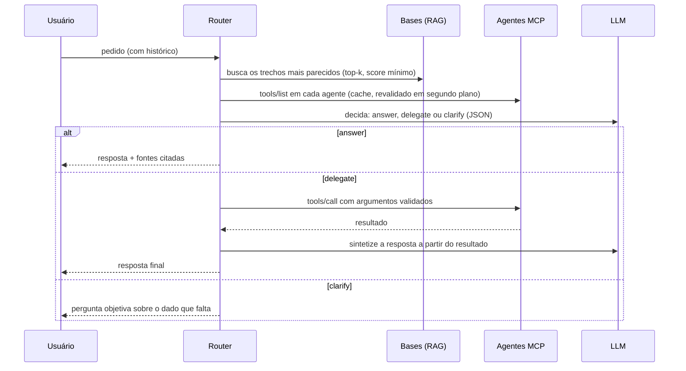
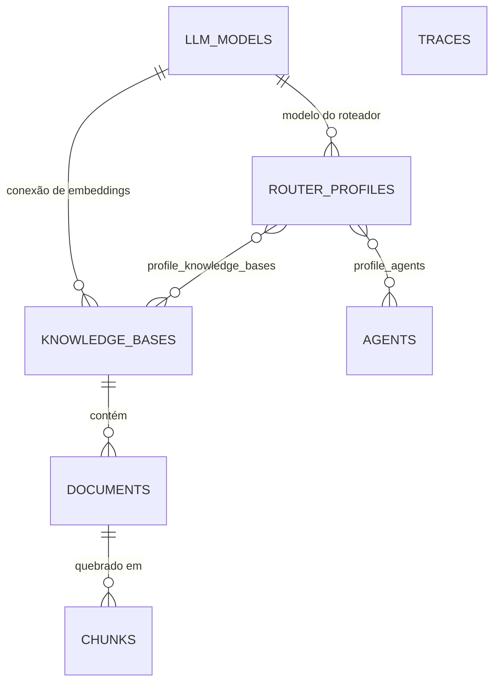

# Arquitetura

O Switchboard separa **quem configura** de **quem atende**, como um gateway separa control plane de data plane:

- **Console** (`apps/console`) — monólito com UI server-rendered (FastAPI + Jinja) e API admin em JSON. Grava modelos, agentes, bases e roteadores no banco, indexa documentos e mostra as execuções.
- **Router** (`apps/router`) — API de chat. Lê a configuração do banco (cache de 5 s), atende os pedidos e grava um trace por pedido.
- **Core** (`packages/core`, pacote `switchboard`) — o framework usado pelos dois: provedores de LLM, embeddings, RAG, cliente MCP, motor de roteamento e storage. Também roda sozinho, configurado por YAML.

## Fluxo de um pedido



Cada etapa vira um passo do trace (`rag`, `descoberta_mcp`, `decisao`, `delegacao_mcp`, `sintese`) com duração e detalhes, visível no console e devolvido na API nativa.

### 1. RAG

A pergunta (o último turno do usuário; turnos muito curtos herdam o anterior, para follow-ups como "e no sábado?") é transformada em vetor pelo embedder de cada base e comparada por similaridade de cosseno com os trechos indexados. Entram no prompt os `top_k` trechos com score acima de `min_score`, numerados (`[1]`, `[2]`…) com base, documento e seção.

### 2. Descoberta via MCP

Para cada agente habilitado do roteador, o catálogo abre uma sessão MCP (Streamable HTTP ou SSE), faz o handshake e chama `tools/list` (seguindo a paginação). A descoberta tem timeout curto (5 s) e o resultado fica em cache (30 s para agentes online, 15 s para offline); quando o cache vence, o valor antigo é servido na hora e a nova descoberta roda em segundo plano — um agente travado nunca segura os pedidos. Agentes fora do ar saem do prompt e geram um aviso no trace; o atendimento continua com o que está disponível. A allowlist do agente filtra as tools antes de chegarem ao LLM.

### 3. Decisão

O LLM recebe o system prompt do roteador, as regras de roteamento, o catálogo (agente → tools → schema de argumentos compacto) e os trechos, e devolve **um objeto JSON**:

```json
{"action": "answer",   "answer": "...", "sources": [1, 2], "reason": "..."}
{"action": "delegate", "agent": "credito", "tool": "simular_financiamento", "arguments": {"valor": 50000, "prazo_meses": 24, "taxa_mensal_percentual": 1.5}, "reason": "..."}
{"action": "clarify",  "question": "...", "reason": "..."}
```

A leitura é tolerante (aceita bloco ```json, texto em volta, sinônimos em português como `delegar`) e a decisão é **validada contra o catálogo real**: agente e tool precisam existir, argumentos são convertidos e conferidos contra o `inputSchema` (tipos, `enum`, obrigatórios). Se algo não bate, o motor manda o erro de volta ao modelo pedindo um reparo (uma tentativa). Se ainda faltar argumento obrigatório, vira uma pergunta de esclarecimento. Com provedor compatível com OpenAI, a decisão usa `response_format: json_object` quando o servidor aceita.

Sem LLM (modelo `offline`) ou com o provedor fora do ar, o **decisor heurístico** assume: casa palavras-chave do pedido com nome e descrição das tools, extrai argumentos do texto (R$, mil, %, meses, anos, opções de `enum`) e responde de forma extrativa com o melhor trecho da base.

### 4. Execução

- `answer`: devolve a resposta com as fontes citadas.
- `delegate`: chama a tool via `tools/call`; o resultado (ou o erro) vai para a síntese pelo LLM, que escreve a resposta final sem inventar nada além do resultado. Com `synthesize` desligado, o texto do agente volta como veio.
- `clarify`: devolve a pergunta. O próximo turno do usuário chega com o histórico e completa os argumentos.

## Recarga de configuração

O router relê cada roteador do banco a cada `SWITCHBOARD_CONFIG_TTL_S` (5 s) e só recria o motor quando o fingerprint da configuração efetiva muda (spec do roteador + modelo + agentes). Clientes HTTP de modelos que saíram de uso são fechados depois de 30 s, para não cortar pedidos em andamento.

## Modelo de dados



- `llm_models` — provedor, modelo, URL, chave (`env:` ou cifrada), cabeçalho da chave, parâmetros de geração.
- `agents` — URL MCP, transporte, token (`env:` ou cifrado), allowlist de tools, timeout.
- `knowledge_bases` / `documents` / `chunks` — embedder, tamanho de trecho; `chunks.embedding` é `vector` (pgvector, sem dimensão fixa: cada base pode ter a sua) ou JSON; documentos guardam o embedder usado, e a UI aponta quando é preciso reindexar.
- `router_profiles` — modelo, system prompt, agentes, bases, `top_k`, `min_score`, `synthesize`, `allow_clarify`.
- `traces` — pedido, resposta, rota, agente/tool/argumentos, fontes, passos com duração, avisos, tokens e latência.

As tabelas são criadas na subida (`Database.init`, protegido por advisory lock no PostgreSQL para console e router subirem juntos). Migrações versionadas estão no roadmap.

## Segredos

Campos de segredo aceitam `env:NOME` (resolvido no processo que usa o segredo — por isso as variáveis de provedor vão para console e router no compose) ou texto, que o console cifra com Fernet (`enc:...`). A chave Fernet vem, via PBKDF2, da chave mestra: `SWITCHBOARD_SECRET_KEY` ou o arquivo `SWITCHBOARD_SECRET_KEY_FILE`, gerado com 256 bits aleatórios na primeira subida (no compose, num volume compartilhado por console e router). Referências `env:` só valem para nomes liberados em `SWITCHBOARD_ALLOWED_ENV_SECRETS` (padrão `*_API_KEY,MCP_*`; `SWITCHBOARD_*` nunca), para que quem edita a configuração não consiga ler outras variáveis do processo. A UI e a API admin só mostram o tipo do segredo, nunca o valor.

## Pontos de extensão

| Quer… | Implemente | Onde |
|---|---|---|
| outro provedor de LLM | `ChatModel` (`chat`, `aclose`, `label`, `offline`) | `switchboard/llm/` + `build_chat_model` |
| outro embedder | `Embedder` (`embed`, `aclose`, `label`) | `switchboard/embeddings.py` |
| outra fonte de conhecimento | `Retriever.search(...)` | `switchboard/rag/retriever.py` |
| outra estratégia de decisão | `Decider.decide(...)` / `Composer.compose(...)` | `switchboard/routing/deciders.py` |
| outro transporte de agente | um `Connector` para o `AgentCatalog` | `switchboard/agents/catalog.py` |

Para testes, `switchboard.testing` traz `ScriptedChat` (LLM roteirizado) e `inproc_connector` (agentes MCP no mesmo processo, sem rede).
